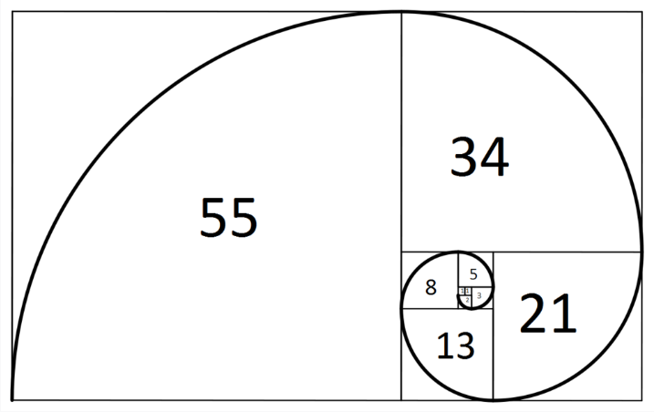

# Fibonacci

피보나치 수는 피보나치 수열이라고 하는 다음과 같은 정수 수열의 수이며, 처음 두 수 다음의 모든 수는 앞선 두 수의 합이라는 사실을 특징으로 한다.
+ 수학에서, 피보나치 수는 첫째 및 둘째 항이 1이며 그 뒤의 모든 항은 바로 앞 두 항의 합인 수열이다. 처음 여섯 항은 각각 1, 1, 2, 3, 5, 8이다. 편의상 0번째 항을 0으로 두기도 한다.
```
0, 1, 1, 2, 3, 5, 8, 13, 21, 34, 55 ...

// 피보나치 JS구현
function fibonacci(number) {
  let result = [0, 1];
  if (number === 0) {
    console.log([0]);
  }
  if (number === 1) {
    console.log([0, 1])
  }
  for (let i = 2; i <= number; i++){
    result.push(result[i - 2] + result[i - 1]);
    console.log(result);
  }
}
```

