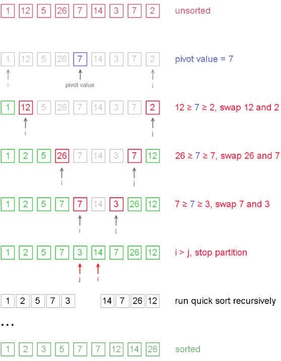

# Quick sort
1960년에 찰스 앤터니 리처드 호어(C.A.R hoare)가 처음 제안한 방법으로 현존하는 가장 빠른 정렬 알고리즘 중에 하나이다.
퀵 정렬은 in place 방법과 in place가 아닌 방법 2가지가 있는데 실제로 많이 쓰이는 방법은 메모리 사용량이 적은 in place 방법이다.

### 퀵정렬 알고리즘의 구체적인 개념
하나의 리스트를 피벗(pivot)을 기준으로 두 개의 비균등한 크기로 분할하고 분할된 부분 리스트를 정렬한 다음, 두 개의 정렬된 부분 리스트를 합하여 전체가 정렬된 리스트가 되게 하는 방법이다.

퀵 정렬은 다음의 단계들로 이루어진다.
1. 분할(Divide): 입력 배열을 피벗을 기준으로 비균등하게 2개의 부분 배열(피벗을 중심으로 왼쪽: 피벗보다 작은 요소들, 오른쪽: 피벗보다 큰 요소들)로 분할한다.
1. 정복(Conquer): 부분 배열을 정렬한다. 부분 배열의 크기가 충분히 작지 않으면 순환 호출 을 이용하여 다시 분할 정복 방법을 적용한다.
1. 결합(Combine): 정렬된 부분 배열들을 하나의 배열에 합병한다.
1. 순환 호출이 한번 진행될 때마다 최소한 하나의 원소(피벗)는 최종적으로 위치가 정해지므로, 이 알고리즘은 반드시 끝난다는 것을 보장할 수 있다.

```
// Not in place(Basic)
// in place 방법이 아니기 때문에 별도의 메모리 공간이 필요하므로 데이터의 양이 많으면 공간적인 낭비가 심해져 실제로는 잘 쓰이지 않는 방법이다.

function quickSort (array) {
  if (array.length < 2) {
    return array;
  }
  const pivot = [array[0]];
  const left = [];
  const right = [];
 
  for (let i = 1; i < array.length; i++) {
    if (array[i] < pivot) {
      left.push(array[i]);
    } else if (array[i] > pivot) {
      right.push(array[i]);
    } else {
      pivot.push(array[i]);
    }
  }
  console.log(`left: ${left}, pivot: ${pivot}, right: ${right}`);
  return quickSort(left).concat(pivot, quickSort(right));
}
 
const sorted = quickSort([5, 3, 7, 1, 9]);
console.log(sorted);
```


```
// In place Quick sort

function quickSort (array, left = 0, right = array.length - 1) {
  if (left >= right) {
    return;
  }
  const mid = Math.floor((left + right) / 2);
  const pivot = array[mid];
  const partition = divide(array, left, right, pivot);
 
  quickSort(array, left, partition - 1);
  quickSort(array, partition, right);
 
  function divide (array, left, right, pivot) {
    console.log(`array: ${array}, left: ${array[left]}, pivot: ${pivot}, right: ${array[right]}`)
    while (left <= right) {
      while (array[left] < pivot) {
        left++;
      }
      while (array[right] > pivot) {
        right--;
      }
      if (left <= right) {
        let swap = array[left];
        array[left] = array[right];
        array[right] = swap;
        left++;
        right--;
      }
    }
    return left;
  }
 
  return array;
}
```